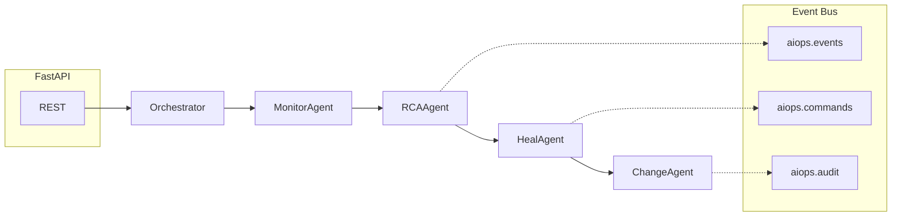

# Multi-Agent AIOps（Python）

> 面向演示与学习的企业级 **多 Agent 智能运维** 骨架：告警 → 根因分析（RCA）→ 故障自愈（Heal）→ 变更审批（Change），基于 **事件总线** 与 **状态机编排**。

[](https://www.python.org/)
[](https://fastapi.tiangolo.com/)

---

## 目录

- [功能概览](#功能概览)
- [系统架构](#系统架构)
- [目录结构](#目录结构)
- [快速开始](#快速开始)
- [配置说明](#配置说明)
- [可选基础设施（Docker Compose）](#可选基础设施docker-compose)
- [HTTP API](#http-api)
- [Agent 与工作流](#agent-与工作流)
- [知识图谱](#知识图谱)
- [安全与护栏](#安全与护栏)
- [开发与测试](#开发与测试)
- [已知限制](#已知限制)

---

## 功能概览

| 模块 | 说明 |
|------|------|
| **Monitor Agent** | 生成/处理告警事件（Demo 场景） |
| **RCA Agent** | 依赖链追踪 + 证据收集 + 简化贝叶斯推理，输出根因与建议动作 |
| **Heal Agent** | Playbook 映射、Dry-run、爆炸半径检查、熔断器、分级自愈 |
| **Change Agent** | 风险评分模型 + 审批决策 + 审计日志 |
| **Orchestrator** | LangGraph 风格的线性状态机：条件跳过、重试、检查点快照 |
| **Event Bus** | 内存实现（可替换为 Kafka）；Agent 通过主题发布事件 |
| **Knowledge Graph** | 内存图 + Neo4j 封装（Demo API 使用内存拓扑） |
| **异常检测 Demo** | `EnsembleDetector` 集成多种算法投票 |

---

## 系统架构



**默认链路**：`Monitor → RCA → Heal → Change`

- RCA 仅在存在 `alert_event` 时执行。
- Heal 仅在 `rca_event` 存在且 **置信度 ≥ 0.3** 时执行。
- Change 仅在存在 `heal_event` 时执行。

---

## 目录结构

```
python/
├── agents/                 # 各业务 Agent
│   ├── base_agent.py
│   ├── monitor_agent.py
│   ├── rca_agent.py
│   ├── heal_agent.py
│   └── change_agent.py
├── api/
│   └── main.py             # FastAPI 入口、生命周期、路由
├── config/
│   ├── settings.py         # 环境变量（前缀 AIOPS_）
│   └── prometheus.yml      # Prometheus 示例配置
├── core/
│   ├── orchestrator.py     # 工作流编排器
│   ├── event_bus.py        # 事件总线（内存 / Kafka 扩展位）
│   └── knowledge_graph.py  # 内存图 + Neo4jKnowledgeGraph
├── models/
│   ├── events.py           # Pydantic 事件与 IncidentState
│   └── time_series.py      # 时序与集成异常检测
├── docker-compose.yml      # Kafka / Neo4j / Prometheus / Grafana
├── requirements.txt
└── README.md
```

---

## 快速开始

### 1. 创建虚拟环境（推荐）

```bash
cd python
python -m venv .venv

# Windows
.venv\Scripts\activate

# macOS / Linux
source .venv/bin/activate
```

### 2. 安装依赖

```bash
pip install -r requirements.txt
```

> **提示**：`config/settings.py` 使用 `pydantic_settings.BaseSettings`。若运行时报缺少该模块，请执行：  
> `pip install pydantic-settings`

### 3. 启动 API 服务

在项目根目录 **`python/`** 下执行（保证 `api` 包可被解析）：

```bash
uvicorn api.main:app --reload --host 0.0.0.0 --port 8000
```

- 文档：`http://127.0.0.1:8000/docs`
- 健康检查：`GET http://127.0.0.1:8000/health`

### 4. 触发一次完整事件流（示例）

```bash
curl -X POST "http://127.0.0.1:8000/api/v1/incidents/trigger" ^
  -H "Content-Type: application/json" ^
  -d "{\"metric_name\": \"cpu_usage\", \"metric_value\": 95.0, \"target_service\": \"order-service\"}"
```

（Linux / macOS 将 `^` 换为 `\`）

### 5. 单独运行编排 Demo（无需 HTTP）

```bash
python -m core.orchestrator
```

---

## 配置说明

通过环境变量或项目根目录 `.env` 注入（**前缀：`AIOPS_`**），见 [`config/settings.py`](config/settings.py)。

| 变量示例 | 含义 |
|----------|------|
| `AIOPS_DEBUG` | 调试开关 |
| `AIOPS_KAFKA_BOOTSTRAP_SERVERS` | Kafka 地址 |
| `AIOPS_NEO4J_URI` / `AIOPS_NEO4J_USER` / `AIOPS_NEO4J_PASSWORD` | Neo4j 连接 |
| `AIOPS_OPENAI_API_KEY` | LLM（预留，按需接入） |
| `AIOPS_HEAL_DRY_RUN` | 自愈是否 Dry-run |
| `AIOPS_CHANGE_AUTO_APPROVE_THRESHOLD` | 变更自动审批风险阈值 |
| `AIOPS_CIRCUIT_BREAKER_THRESHOLD` | 熔断失败次数阈值 |
| `AIOPS_BLAST_RADIUS_MAX_PERCENT` | 最大允许爆炸半径 |

---

## 可选基础设施（Docker Compose）

根目录 [`docker-compose.yml`](docker-compose.yml) 提供常用外围组件：

| 服务 | 端口 | 说明 |
|------|------|------|
| Kafka | `9092` | 事件流（当前 Demo API 默认使用内存总线） |
| Neo4j | `7474`（HTTP）、`7687`（Bolt） | 图存储（默认账号见 compose） |
| Prometheus | `9090` | 指标采集 |
| Grafana | `3000` | 可视化（默认密码见 compose） |

```bash
docker compose up -d
```

---

## HTTP API

| 方法 | 路径 | 说明 |
|------|------|------|
| `GET` | `/` | 服务信息与 Agent 列表 |
| `GET` | `/health` | 健康检查 |
| `POST` | `/api/v1/incidents/trigger` | 触发完整工作流 |
| `GET` | `/api/v1/incidents` | 最近事件历史（内存，最多保留片段） |
| `GET` | `/api/v1/incidents/{incident_id}` | 单条事件详情 |
| `GET` | `/api/v1/topology` | 知识图谱摘要 |
| `GET` | `/api/v1/topology/{service}/dependencies` | 服务依赖、影响分、路径采样 |
| `POST` | `/api/v1/anomaly/detect` | 对给定序列做异常检测 |
| `GET` | `/api/v1/anomaly/demo` | 自动生成数据并检测 |
| `GET` | `/api/v1/agents/status` | 工作流节点与事件日志大小 |

---

## Agent 与工作流

### Agent 职责简述

1. **MonitorAgent**：构造 `AlertEvent`，写入 `IncidentState`。
2. **RCAAgent**：基于拓扑与证据更新 `RCAEvent`（当前拓扑主要为 `rca_agent.py` 内 `MOCK_SERVICE_TOPOLOGY`，与 `knowledge_graph` 模块可 further 打通）。
3. **HealAgent**：选择 playbook → Dry-run →（满足条件时）模拟执行 → `HealEvent`，并结合熔断器。
4. **ChangeAgent**：`RiskScorer` 打分 → `_make_decision` → `ChangeEvent` + 审计 → 更新 `state.status`。

### 核心状态载体

`IncidentState`（见 [`models/events.py`](models/events.py)）在编排器中逐步填充：

`alert_event` → `rca_event` → `heal_event` → `change_event`

---

## 知识图谱

实现见 [`core/knowledge_graph.py`](core/knowledge_graph.py)。

| 类型 | 示例 |
|------|------|
| **节点** | `Service`、`Pod`、`Node`、`Metric`、`Alert`、`Change`（设计及 Neo4j 约束）；Demo 内存图中大量使用服务名与 `host` |
| **关系** | `DEPENDS_ON`、`RUNS_ON`、`MONITORS`、`TRIGGERED`、`CAUSED_BY`；Neo4j 示例中还有 `AFFECTS` |

- **内存 Demo**：`create_demo_knowledge_graph()`，供 `/api/v1/topology*` 使用。
- **Neo4j**：`Neo4jKnowledgeGraph` 类提供 schema、写入依赖、Cypher 根因与变更查询（需在应用中接线）。

---

## 安全与护栏

本项目强调「自动化但不盲动」，主要包括：

- **自愈分级**：`HealLevel`（L0 / L1 / L2）。
- **Dry-run**：执行前模拟。
- **熔断器**：连续失败暂停自愈。
- **爆炸半径**：超过阈值则升高干预级别（如偏向人工）。
- **变更审批**：多维风险分 + 阈值与人工路径 + 审计日志。

生产落地时建议额外补齐：**身份认证、RBAC、密钥管理、命令白名单、真实 kubectl/API 网关幂等与审计持久化**。

---

## 开发与测试

```bash
# 代码风格（如有配置）
pytest -q
```

依赖中包含 `pytest`、`pytest-asyncio`，可按需为 Agent 与编排器补充异步单测。

---

## 已知限制

- API 层 **`incident_history`** 与 **`Orchestrator` 检查点** 均为进程内内存，重启丢失。
- 默认 **`InMemoryEventBus`**，与 `docker-compose` 中的 Kafka 未自动串联。
- **RCA** 当前以 Mock 拓扑与规则为主，与 **Neo4j** 的整合需自行扩展 `RCAAgent` 构造注入。
- `requirements.txt` 未列出 `pydantic-settings` 时，加载 `config.settings` 可能需手动安装。

---

## 许可证

以项目原作者 / 上游仓库的许可声明为准；本目录若未附带 `LICENSE` 文件，使用前请自行确认授权条款。

---

**Maintainer notes**：本文档随代码演进更新；接口与默认值以 `api/main.py`、`core/orchestrator.py`、`config/settings.py` 为准。
